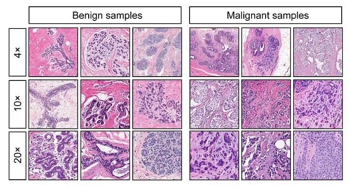

# 🎗️ Breast Cancer Prediction

A machine learning tool to classify breast cancer tumors as benign or malignant using a Random Forest model. Built with Flask, featuring a modern Bootstrap 5 interface and a REST API.

<p align="center">

## 📋 Overview
Breast Cancer Prediction leverages machine learning to classify breast cancer tumors based on five key features from the Breast Cancer Wisconsin Dataset. With a user-friendly web interface and a powerful REST API, this tool provides accurate predictions with confidence scores in seconds.

## 🎯 Key Objectives

- Predict tumor type: Benign or Malignant
- Provide confidence scores for predictions
- Offer an intuitive web interface and API for seamless integration

## 🛠️ Tech Stack

| Technology | Purpose |
|------------|---------|
| Flask 🐍 | Backend framework |
| Bootstrap 5 🎨 | Responsive UI |
| Scikit-learn 📊 | Machine learning |
| Render ☁️ | Hosting platform |

## ✨ Features

- 🌐 **Interactive Web Interface**: Input tumor features and get instant predictions.
- ⚙️ **REST API**: Programmatic access for developers via `/api/predict`.
- 📈 **Random Forest Model**: Trained on 5 features:
  - worst area
  - worst concave points
  - mean concave points
  - worst radius
  - mean concavity
- ✅ **High Accuracy**: Reliable predictions with confidence scores.

## 📂 Project Structure
```
breast-cancer-prediction/
├── app.py                    # Flask application
├── rf_model_selected.pkl     # Trained Random Forest model
├── scaler_selected.pkl       # Feature scaler
├── requirements.txt          # Python dependencies
├── templates/
│   └── index.html            # Bootstrap 5 web interface
├── images/
│   └── cancer_samples.jpg    # Cancer tissue samples
├── LICENSE                   # MIT License
└── README.md                 # Project documentation
```

## 🚀 Getting Started

### 📋 Prerequisites

- 🐍 Python 3.8 or higher
- 📥 Git
- 🌐 A web browser
- 🛠️ Postman or cURL (for API testing)

### 🛠️ Installation

**Clone the Repository 📦**
```bash
git clone https://github.com/BlackRazor34/breast-cancer-prediction.git
cd breast-cancer-prediction
```

**Set Up a Virtual Environment 🖥️**
```bash
python -m venv venv
source venv/bin/activate  # On Windows: venv\Scripts\activate
```

**Install Dependencies 📚**
```bash
pip install -r requirements.txt
```

**Run Locally ▶️**
```bash
python app.py
```

Access the app at http://127.0.0.1:8080.

## 🌟 Usage

### 🖥️ Web Interface

- Visit the live app: [https://breast-cancer-prediction-eimi.onrender.com](https://breast-cancer-prediction-eimi.onrender.com) 🌐
- Enter the following tumor features:

| Feature | Example Value | Typical Range |
|---------|---------------|---------------|
| worst area | 711.2 | 200–2500 |
| worst concave points | 0.1288 | 0–0.3 |
| mean concave points | 0.04781 | 0–0.3 |
| worst radius | 15.11 | 6–28 |
| mean concavity | 0.06664 | 0–0.3 |

- Click **Predict** to see the result (Benign or Malignant) and confidence score. ✅
- Use the **Fill Example Values** button to test with sample data.

### ⚙️ REST API
The `/api/predict` endpoint accepts POST requests with JSON data.

- **Endpoint**: https://breast-cancer-prediction-eimi.onrender.com/api/predict
- **Method**: POST
- **Header**: `Content-Type: application/json`
- **Request Body**:
```json
{
  "worst area": 711.2,
  "worst concave points": 0.1288,
  "mean concave points": 0.04781,
  "worst radius": 15.11,
  "mean concavity": 0.06664
}
```

**Example Request (cURL)**
```bash
curl -X POST -H "Content-Type: application/json" -d '{"worst area": 711.2, "worst concave points": 0.1288, "mean concave points": 0.04781, "worst radius": 15.11, "mean concavity": 0.06664}' https://breast-cancer-prediction-eimi.onrender.com/api/predict
```

**Example Response**
```json
{
  "prediction": "Benign",
  "confidence": 99.50,
  "features": {
    "worst area": 711.2,
    "worst concave points": 0.1288,
    "mean concave points": 0.04781,
    "worst radius": 15.11,
    "mean concavity": 0.06664
  }
}
```

**Test with Postman 🛠️**

1. Open Postman and create a new HTTP request.
2. Set method to POST and URL to https://breast-cancer-prediction-eimi.onrender.com/api/predict.
3. Add header: `Content-Type: application/json`.
4. In the "Body" tab, select "raw" and "JSON", then paste the example JSON.
5. Click "Send" to see the response.

## 📸 Understanding Cancer Tissue Samples
The model is trained on histological images of breast cancer tissues. Below is a visual comparison of benign and malignant samples at different magnifications (4x, 10x, 20x):

<p align="center">

- **Benign Samples**: Typically show more organized structures and less cellular density.
- **Malignant Samples**: Display irregular structures, higher cellular density, and more aggressive growth patterns.

## 📊 Model Performance
The Random Forest model was trained on the Breast Cancer Wisconsin Dataset and achieves high accuracy. Key metrics:

- **Accuracy**: ~95% (cross-validated)
- **Features Used**: 5 (selected for optimal performance)
- **Confidence Scores**: Provided with each prediction for transparency.

## ☁️ Deployment on Render

1. Create a new Web Service on Render.
2. Connect your GitHub repository: https://github.com/BlackRazor34/breast-cancer-prediction.
3. Configure:
   - **Environment**: Python 🐍
   - **Build Command**: `pip install -r requirements.txt`
   - **Start Command**: `gunicorn app:app`
   - **Instance Type**: Free

4. Deploy the service. Your app will be live at https://breast-cancer-prediction-eimi.onrender.com.

## 📝 Notes

- **Free Tier Limitations**: Render's free plan may cause delays after inactivity. Be patient with the first request! ⏳
- **Model Files**: Ensure `rf_model_selected.pkl` and `scaler_selected.pkl` are in the repository or manually uploaded to Render's `/app/` directory.
- **Future Improvements**:
  - Add a `/docs` endpoint for API documentation.
  - Implement input validation for negative values.
  - Optimize the model for better performance on free-tier hosting.

## 🤝 Contributing
Contributions are welcome! To contribute:

1. Fork the repository.
2. Create a new branch (`git checkout -b feature/YourFeature`).
3. Make your changes and commit (`git commit -m 'Add your feature'`).
4. Push to your branch (`git push origin feature/YourFeature`).
5. Open a Pull Request.

## 📜 License
This project is licensed under the MIT License. See LICENSE for details.

## 🙌 Acknowledgments

Built with ❤️ using:
- Flask
- Scikit-learn
- Bootstrap 5

Hosted on Render
Dataset: Breast Cancer Wisconsin Dataset

***Help fight breast cancer with technology! 🎗️***
